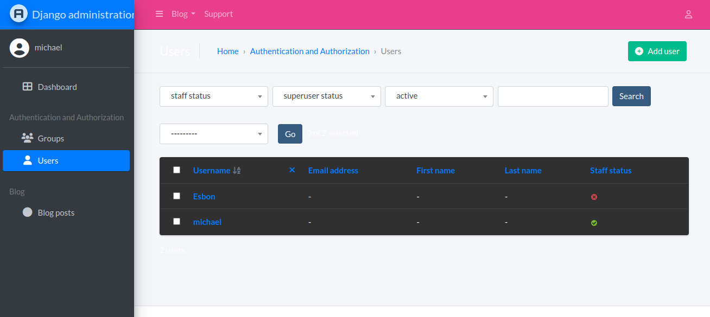

# Django Project with Jazzmin Admin Interface

## Preview

Here’s a preview of the custom admin interface using Jazzmin:

A Django project that includes a blog app with a custom admin interface using the [Jazzmin](https://django-jazzmin.readthedocs.io/en/latest/) theme. This project allows users to create, view, and manage blog posts through a user-friendly admin panel.
